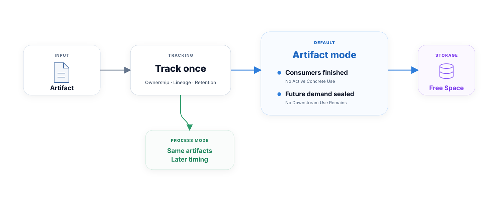

<h1 align="center">nf-gc</h1>

<p align="center"><strong>Lifecycle-aware garbage collection for Nextflow work artifacts.</strong></p>

`nf-gc` reclaims eligible intermediate outputs from a Nextflow work directory while the workflow is still running. Its core entity is always a concrete `Path`: ownership, output provenance, downstream demand, publication, workflow-output retention, and deletion are tracked per artifact. The GC mode changes only the clock used to decide when that artifact is dead.

<p align="center">
  
</p>

`artifact` is the default and recommended mode. `process` uses the same artifact tracking and retention model, but reclaims at process-level boundaries. Unknown ownership or retention resolves to KEEP; liveness uncertainty falls back to a coarser safe boundary.

## Get Started

Enable the plugin in `nextflow.config`:

```groovy
plugins {
    id 'nf-gc@0.3.0'
}
```

No nf-gc-specific configuration is required. Without an explicit setting, nf-gc uses:

```groovy
nfGc {
    gc_mode = 'artifact'
}
```

Use the coarser process clock explicitly when desired:

```groovy
nfGc {
    gc_mode = 'process'
}
```

Both modes use the same concrete-Path detection and deletion model. On an exact direct route, `artifact` mode can reclaim a one-to-one intermediate after its concrete consumer task completes; an exact unused terminal output can be reclaimed at producer-task completion; fan-out and pass-through Paths stay live only while their concrete lineage can still require them. In `process` mode, those same Paths wait for the corresponding producer/consumer process boundaries. Sibling output ports do not keep one another alive simply because they share a producer.

Routes that pass through operators are not interpreted by operator name. nf-gc uses runtime route closure when Nextflow exposes a safe proof; topic-backed, opaque, or otherwise unprovable demand remains conservative and may require the successful global flow seal.

`nf-gc` requires Nextflow `26.04.0` or newer and is validated against Nextflow `26.04.6`.

## Usage

Run a pipeline normally with the plugin configured, or select it from the command line:

```bash
nextflow run main.nf -plugins nf-gc@0.3.0
```

### Publication and peak disk

For the lowest peak disk usage, prefer `publishDir mode: 'link'` when the work and results paths are on the same filesystem. Hard-link publication does not duplicate the payload and gives nf-gc synchronous publication evidence. `copy` and `copyNoFollow` create independent result payloads and Nextflow publishes them asynchronously, so unresolved `saveAs` decisions may keep candidate work artifacts alive until successful flow completion. `symlink` and `rellink` also avoid payload duplication, but the published entry remains dependent on its work-directory backing target.

nf-gc never re-runs a user `saveAs` closure. It uses Nextflow's `FilePublishEvent` evidence instead. With normal fail-on-error publication, a successful flow completion can safely resolve deferred async candidates after the publication pool has drained; when publication failures are configured as non-fatal, absence of a publish event remains ambiguous and the source is kept.

## Safety model

nf-gc is intentionally conservative at boundaries it cannot prove. In particular:

- only successful, non-cached outputs owned by the task work directory are candidates;
- external/staged inputs are never acquired merely because they appear inside a task work directory;
- exact workflow outputs and published artifacts are retained per concrete Path when provenance is known;
- derived or unmatched workflow-output provenance falls back conservatively for the run;
- `topic:` demand is not mistaken for a terminal DAG leaf;
- ancestor/descendant outputs and filesystem aliases that are not independent deletion units are retained conservatively;
- deletion never follows symbolic links;
- reclaimed work artifacts are not guaranteed to remain available to a later `-resume` run.

Ownership or retention uncertainty means KEEP. Liveness uncertainty means WAIT at a coarser safe boundary.

## Validation

The repository has deterministic semantic tests for both clocks, regression tests for ownership/publication/filesystem safety, and a pinned `nf-core/rnaseq 3.26.0` acceptance workload against Nextflow `26.04.6`. The acceptance matrix runs `process + link`, `artifact + link`, and `artifact + copy`, requires the same eventual reclaim set across policies, and verifies that artifact mode retains a real mid-run timing advantage without damaging published results.

For repository development:

```bash
./scripts/bootstrap-dev.sh
source scripts/env.sh
./scripts/test.sh
```

Test and field runs can enable nf-gc's lifecycle trace through Nextflow configuration:

```groovy
env.NF_GC_TEST_TRACE = 'true'
```

The trace is test-only observability and is not part of the public `nfGc` configuration API. A host-shell `export NF_GC_TEST_TRACE=true` alone does not enable it. See [tests/testing.md](tests/testing.md) for the behavioral contract and trace schema.

## Contributing

- [Contribution guide](docs/contributing.md)
- [Reporting issues](docs/issues.md)
- [Testing](tests/testing.md)
- [Changelog](CHANGELOG.md)

## License

Licensed under the Apache License 2.0. See [LICENSE](LICENSE) for the full license text.
